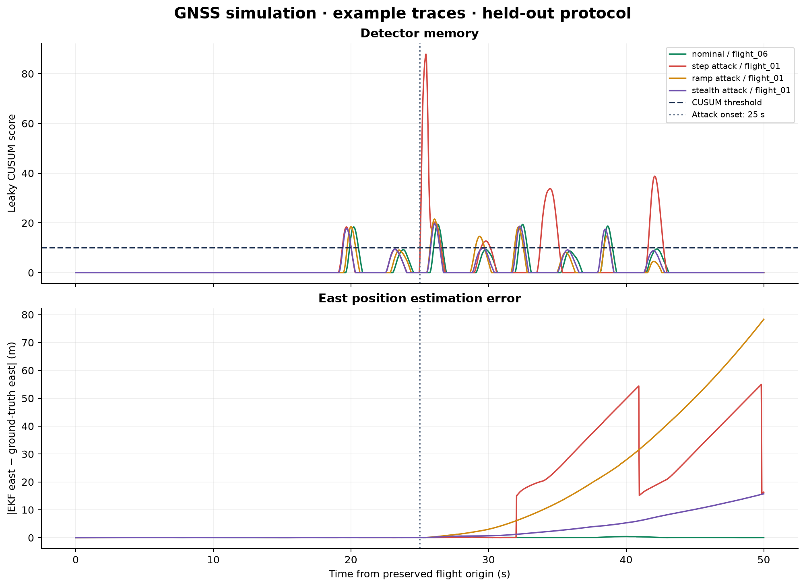

# Drone GPS Simulation

**Reproducible simulation data and analysis for GNSS spoofing detection.**

[](https://github.com/selimhanemre/Drone_GPS_Simulation/actions/workflows/tests.yml)
[](LICENSE)
[](requirements.txt)
[](https://github.com/selimhanemre/Drone_GPS_Simulation/releases/tag/v0.1.0)

[Quick start](#quick-start) · [Results](docs/RESULTS.md) · [Reproduce](docs/REPRODUCIBILITY.md) · [Dataset](data/README.md) · [Methodology](docs/METHODOLOGY.md) · [Citation](#citation)

## Associated research

**Defending the Autonomous Airspace: Real-Time Defense of Stealthy GNSS Spoofing via Kinematic Memory**

Selimhan Dagtas · Muzakkiruddin Ahmed Mohammed · Abdelrahman Elfikky

This repository accompanies the research project with 40 PX4 software-in-the-loop flight logs, portable telemetry processing, and three detector baselines: a one-sided standardized residual threshold, Isolation Forest, and leaky CUSUM. Four scenarios contain ten flights each: nominal, step, ramp, and stealth.

The current release supports **offline reproduction**. Publication details and a manuscript PDF were not supplied for this release. The real-time performance implied by the manuscript title has not been established by this offline artifact.

## Research status

The release includes an audit and correction of the supplied analysis. The original extractor silently filled GNSS fields with zeros because its field names did not match the logged PX4 schema. The corrected extractor recovers the real telemetry and fails on missing required fields. Attack onset is **25 seconds**, as confirmed by a project contributor; the original flight time origins are preserved.

**With the supplied detector parameters, all three detectors raise false alarms on all five held-out nominal flights.** High attack-sample F1 scores must be read together with those false alarms. These results support further investigation; they do not establish a reliable deployed defense. See the [results and interpretation](docs/RESULTS.md) and [audit trail](docs/AUDIT.md).



*One example per scenario. Nominal flight 06 is held out from training; the attack examples are flight 01. Full per-flight metrics and vector figures are included.*

## Quick start

Use Python 3.12. The offline example needs no simulator, GPU, or external service.

```bash
git clone https://github.com/selimhanemre/Drone_GPS_Simulation.git
cd Drone_GPS_Simulation
python -m venv .venv
```

Activate the environment:

```bash
# Linux / macOS
source .venv/bin/activate
```

```powershell
# Windows PowerShell
.\.venv\Scripts\Activate.ps1
```

```bash
python -m pip install -r requirements.txt
python src/pipeline/03_evaluate_defenses.py --data-dir data/example --output results/local/demo --protocol held-out
```

The included example contains four full corrected flight CSVs: nominal 01 and 06, step 01, and stealth 01. It checks the workflow; it is **not** the full benchmark. The output contains per-flight metrics, a summary, PNG/PDF/SVG figures, and a run manifest with configuration, training/evaluation identities, package versions, and input hashes.

## Reproduce the full corrected analysis

```bash
python scripts/download_data.py corrected
python src/pipeline/03_evaluate_defenses.py --data-dir data/corrected/synced --output results/local/full --protocol held-out
python scripts/compare_results.py results/corrected-held-out/metrics/detector_benchmark.csv results/local/full/metrics/detector_benchmark.csv
```

The downloader verifies SHA-256 before extraction. Downloads are pinned to release `v0.1.0`. See [reproduction instructions](docs/REPRODUCIBILITY.md) for rebuilding from ULogs, replaying the historical analysis, and checking the environment.

## What is included

| Path | Contents |
| :--- | :--- |
| [`src/pipeline/`](src/pipeline/) | Schema-aware ULog extraction, synchronization, evaluation, and plots |
| [`src/missions/`](src/missions/) | Supplied PX4/Gazebo simulation collection scripts |
| [`configs/`](configs/) | Confirmed onset, detector parameters, and per-flight time origins |
| [`data/`](data/README.md) | Four-flight example, dataset manifests, checksums, and download metadata |
| [`results/corrected-held-out/`](results/corrected-held-out/) | Corrected evaluation: five training nominal flights; 35 evaluated flights |
| [`results/corrected-all-nominal/`](results/corrected-all-nominal/) | Corrected data with the original all-nominal training convention |
| [`results/supplied/`](results/supplied/) | Original CSV and three PDF figures, preserved unchanged |
| [`results/legacy-replay/`](results/legacy-replay/) | Replay of the original zero-GNSS data and 20-second labels |
| [`archive/original-code/`](archive/original-code/) | Original code retained for provenance |

The [versioned release](https://github.com/selimhanemre/Drone_GPS_Simulation/releases/tag/v0.1.0) holds the full raw, supplied processed, and corrected datasets. Large logs and the ZIP's embedded Git history are excluded from the source repository.

## Validation and contribution

```bash
python -m pip install -r requirements-dev.txt
python -m pytest -q
```

CI tests extraction regressions, time alignment, attack boundaries, false-alarm handling, and train/evaluation separation, then runs the included example on Linux and Windows. [Contributions](CONTRIBUTING.md) should include the experiment configuration and input identities for any changed result.

To collect new simulated flights, read the [simulation notes](docs/SIMULATION.md). The original Gazebo world/model modification is missing from the supplied archive, so fresh collection is not yet fully reproducible from this repository alone.

## Citation

Use GitHub's **Cite this repository** menu or [`CITATION.cff`](CITATION.cff). Author order follows the project contributors' supplied manuscript metadata.

```bibtex
@misc{dagtas2026dronegps,
  author = {Dagtas, Selimhan and Mohammed, Muzakkiruddin Ahmed and Elfikky, Abdelrahman},
  title = {{Drone GPS Simulation: Defending the Autonomous Airspace}},
  year = {2026},
  howpublished = {Research software, version 0.1.0},
  url = {https://github.com/selimhanemre/Drone_GPS_Simulation},
  note = {Artifact accompanying Defending the Autonomous Airspace: Real-Time Defense of Stealthy GNSS Spoofing via Kinematic Memory}
}
```

## License

Project code, documentation, and the project-provided simulation datasets are released under the [MIT License](LICENSE). PX4, Gazebo, and Python dependencies retain their respective licenses.
