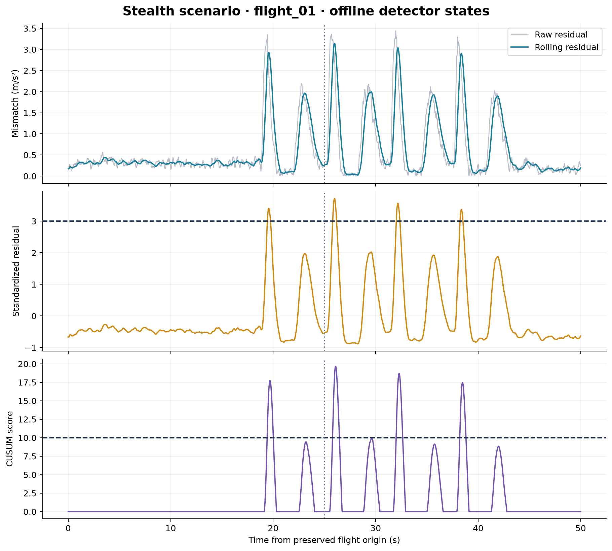

# Results

## Corrected held-out evaluation

The main result uses recovered GNSS telemetry, the confirmed **25-second onset**, and the preserved flight origins. Nominal 01–05 train the detectors; nominal 06–10 and all 30 attack flights are evaluated. Detector parameters are unchanged from the supplied formulation.

**Every detector produces false alarms on all five held-out nominal flights.** The current experiment does not substantiate reliable attack discrimination. High F1 on attack sequences can coexist with pre-onset alarms because alarms remain latched. Read F1, false alarms, and clean-detection counts together.

| Scenario | Detector | Flights | Mean F1 ± SD | Flights with false alarms | Clean detections | Mean latency (s; contributing flights) |
| :--- | :--- | ---: | ---: | ---: | ---: | :--- |
| nominal | Mahalanobis | 5 | not applicable | 5/5 | not applicable | — (0) |
| nominal | IsoForest | 5 | not applicable | 5/5 | not applicable | — (0) |
| nominal | Leaky_CUSUM | 5 | not applicable | 5/5 | not applicable | — (0) |
| step_attack | Mahalanobis | 10 | 0.898 ± 0.005 | 10/10 | 0/10 | — (0) |
| step_attack | IsoForest | 10 | 0.930 ± 0.048 | 7/10 | 3/10 | 0.020 (3) |
| step_attack | Leaky_CUSUM | 10 | 0.898 ± 0.005 | 10/10 | 0/10 | — (0) |
| ramp_attack | Mahalanobis | 10 | 0.898 ± 0.010 | 10/10 | 0/10 | — (0) |
| ramp_attack | IsoForest | 10 | 0.926 ± 0.043 | 8/10 | 2/10 | 0.880 (2) |
| ramp_attack | Leaky_CUSUM | 10 | 0.898 ± 0.010 | 10/10 | 0/10 | — (0) |
| stealth_attack | Mahalanobis | 10 | 0.903 ± 0.006 | 10/10 | 0/10 | — (0) |
| stealth_attack | IsoForest | 10 | 0.965 ± 0.033 | 2/10 | 8/10 | 0.953 (8) |
| stealth_attack | Leaky_CUSUM | 10 | 0.902 ± 0.005 | 10/10 | 0/10 | — (0) |

Latency is conditional on a true-positive alarm with **no preceding false alarm**. A blank CSV latency or dash in the table is not zero. Nominal F1 is zero in the machine-readable CSV by convention and is shown as not applicable here. SD is the across-flight sample standard deviation, not a confidence interval.

## Inspect the outputs

| Run | Purpose | Files |
| :--- | :--- | :--- |
| Corrected held-out | Main evaluation of the unchanged detector formulations with corrected data and onset | [Metrics](../results/corrected-held-out/metrics/detector_benchmark.csv), [summary](../results/corrected-held-out/metrics/summary.csv), [manifest](../results/corrected-held-out/run.json) |
| Corrected all-nominal | Isolate the effect of the nominal split; nominal evaluation overlaps training | [Metrics](../results/corrected-all-nominal/metrics/detector_benchmark.csv), [manifest](../results/corrected-all-nominal/run.json) |
| Supplied | Original metrics and three figures preserved unchanged; zero-GNSS data and inconsistent onset | [Metrics](../results/supplied/metrics/detector_benchmark.csv), [figures](../results/supplied/figures/) |
| Legacy replay | Audit the historical method using its original data and 20-second labels | [Metrics](../results/legacy-replay/metrics/detector_benchmark.csv), [comparison](../results/legacy-replay/comparison-to-supplied.json) |

## Figures

[Vector PDF](../results/corrected-held-out/figures/detector_overview.pdf) · [Editable SVG](../results/corrected-held-out/figures/detector_overview.svg)

[Vector PDF](../results/corrected-held-out/figures/stealth_internals.pdf) · [Editable SVG](../results/corrected-held-out/figures/stealth_internals.svg)

Figures show one explicit example per category, not an average or a selected best-performing flight. Axes retain the observed peaks without fixed clipping. The position panel reports estimation error, not measured safety margin or tracking-path error.

## Implications for the manuscript

Use the corrected data and disclose the false-alarm behavior. A claim that kinematic memory reliably defends against stealthy spoofing requires additional evidence. The next methodological work is frame/gravity treatment, causal features, and calibration using only training flights, followed by independent validation. This release has not performed that new research or changed thresholds to obtain more favorable scores.
